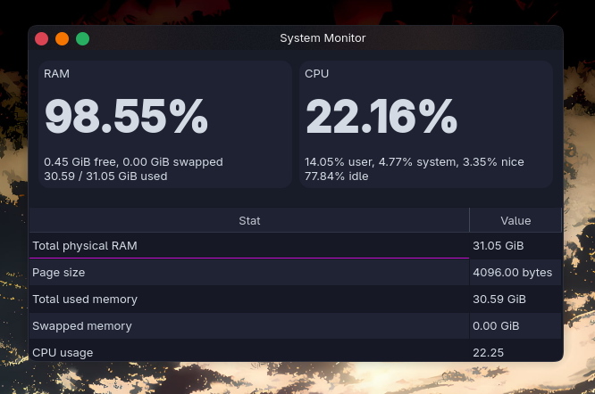

# Simple CPU/RAM monitor with Qt/C++




## Features
- Overall CPU usage: user, system, nice and idle
- RAM usage, with swap. Compressor, app and wired memory available additionally on macOS.
- `--cli` options: dump all metrics into the terminal

## Building
Requires CMake 3.16+, Qt6 and a compiler that supports C++17.

### Linux
> [!IMPORTANT]
> Make sure the qt6 headers are installed on your system. I'll add distro specific package names here when I find the time.

```bash
git clone https://github.com/astudentinearth/system-monitor-qt
mkdir -p system-monitor-qt/build
cd system-monitor-qt/build
cmake .. && cmake --build .
```

You can run with `./system-monitor`, or `./system-monitor --cli` to print to the terminal and exit.

### macOS
Install qt with homebrew

```bash
brew install qt
```

Then:
```bash
git clone https://github.com/astudentinearth/system-monitor-qt
mkdir -p system-monitor-qt/build
cd system-monitor-qt/build
cmake .. && cmake --build .
```

You can run with `./system-monitor`, or `./system-monitor --cli` to print to the terminal and exit.

## How it works

### Linux
RAM usage is retrieved by the `sysinfo()` function from `sys/sysinfo.h` header. CPU usage is measured by polling the first line of `/proc/stat` once a second and calculating the overall usage from the tick deltas. Page size is retrieved from `unistd.h:sysctl` utility on both systems. See [Sensors_linux.cpp](src/system/Sensors_linux.cpp) for the full implementation, it's not that long.

### macOS
RAM usage is retrieved by asking the virtual memory manager of the Mach kernel for page statistics via the `host_statistics64()` API. Total RAM is retrieved by querying the `hw.memsize` attribute with the `sysctl()` utility. Swap usage is retrieved by querying `vm.swapusage` with the same utility. CPU usage is measured by polling the CPU load info with `host_statistics()` API once a second. Page size is retrieved from `unistd.h:sysctl` utility on both systems. See [Sensors_darwin.cpp](src/system/Sensors_darwin.cpp) for the full implementation. 


## Why no Windows?
I prefer unix.

## See also
- [My toy kernel I occasionally work on.](https://github.com/astudentinearth/kernel-limine-efi) I didn't really have to learn much vocabulary to build this system monitor app because of this project alone.
- [Stuff I normally maintain](https://github.com/astudentinearth/darkwrite)

## License

```
The MIT License (MIT)

Copyright © 2026 Burak Yeniçeri

Permission is hereby granted, free of charge, to any person obtaining a copy of this software and associated documentation files (the “Software”), to deal in the Software without restriction, including without limitation the rights to use, copy, modify, merge, publish, distribute, sublicense, and/or sell copies of the Software, and to permit persons to whom the Software is furnished to do so, subject to the following conditions:

The above copyright notice and this permission notice shall be included in all copies or substantial portions of the Software.

THE SOFTWARE IS PROVIDED “AS IS”, WITHOUT WARRANTY OF ANY KIND, EXPRESS OR IMPLIED, INCLUDING BUT NOT LIMITED TO THE WARRANTIES OF MERCHANTABILITY, FITNESS FOR A PARTICULAR PURPOSE AND NONINFRINGEMENT. IN NO EVENT SHALL THE AUTHORS OR COPYRIGHT HOLDERS BE LIABLE FOR ANY CLAIM, DAMAGES OR OTHER LIABILITY, WHETHER IN AN ACTION OF CONTRACT, TORT OR OTHERWISE, ARISING FROM, OUT OF OR IN CONNECTION WITH THE SOFTWARE OR THE USE OR OTHER DEALINGS IN THE SOFTWARE.
```

